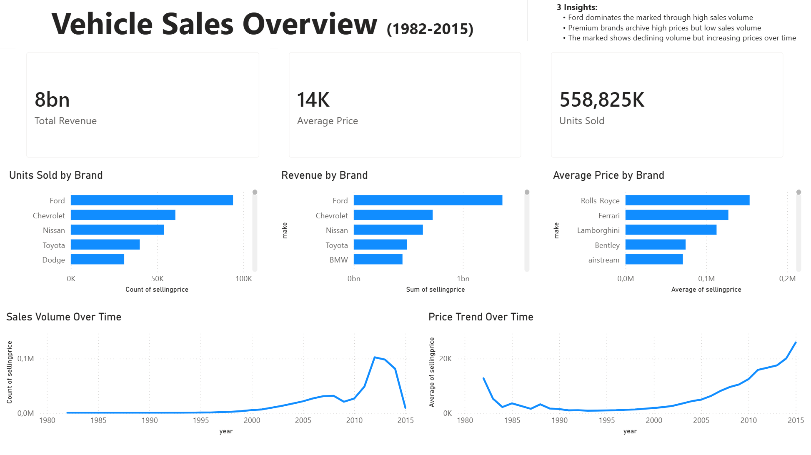
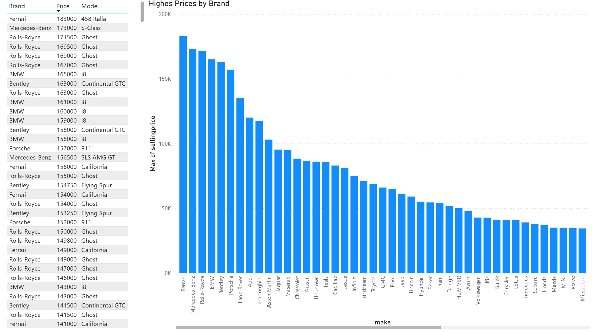

# Vehicle Sales Analysis

## File

Power BI file included in /reports

Dataset-link https://www.kaggle.com/datasets/syedanwarafridi/vehicle-sales-data?resource=download

---

## Overview
This project analyzes vehicle sales data to uncover trends in sales volume, pricing and brand performance.

The goal is to simulate a real-world data analysis workflow:
- Data cleaning 
- Outlier detection
- Business insights

---

## Key insights

- Ford dominates the market through high sales volume
- Premium brands achieve high prices but low sales volume
- The market shows declining volume but increasing prices over time

---

## Data Preparation

- Removed missing brand values (handled as "Unknown")
- Identified and corrected pricing outliers (e.g. scaling errors)
- Validated pricing consistency using model comparisons

---

## Dashboard

### Main Overview

### Outlier Analysis

---

## Tools used

- Power BI
- Power Query
- Basic data analysis techniques

## Skills

- Data cleaning and validation
- Outlier detection and correction
- Data visualization
- Business-oriented thinking
